import Tabs from "@theme/Tabs";
import TabItem from "@theme/TabItem";

# Cloud-Fog-Edge Architecture

## What is Cloud-Fog-Edge Computing?

Cloud-Fog-Edge computing represents an evolutionary paradigm in distributed computing that addresses the limitations of traditional centralized cloud architectures. By distributing computational resources across three hierarchical layers, this model brings processing power closer to data sources and end-users, optimizing for latency, bandwidth, and real-time responsiveness.

```mermaid
%%{init: { 'flowchart': { 'nodeSpacing': 48, 'rankSpacing': 52, 'diagramPadding': 12, 'spacingFactor': 1.15 }, 'themeVariables': { 'fontSize': '14px' } }}%%
graph BT
    subgraph Cloud["☁️ Cloud Layer"]
        C[Centralized Data Centers]
        C_desc["Unlimited resources<br/>High latency<br/>Global scale"]
    end

    subgraph Fog["🌫️ Fog Layer"]
        F[Regional Computing Nodes]
        F_desc["Moderate resources<br/>Medium latency<br/>Regional scale"]
    end

    subgraph Edge["📱 Edge Layer"]
        E[Local Devices & Gateways]
        E_desc["Limited resources<br/>Low latency<br/>Local scale"]
    end

    subgraph Sources["Data Sources"]
        IoT[IoT Sensors]
        Mobile[Mobile Devices]
        Vehicles[Connected Vehicles]
        Industrial[Industrial Equipment]
    end

    Sources --> Edge
    Edge --> Fog
    Fog --> Cloud

    style Cloud fill:#e1f5ff
    style Fog fill:#fff4e1
    style Edge fill:#ffe1e1
    style Sources fill:#e1ffe1
```



## The Three Layers Explained

### ☁️ Cloud Computing Layer

The **Cloud** represents the traditional centralized computing model—massive data centers operated by providers like AWS, Google Cloud, Microsoft Azure, and others.

**Core Characteristics:**

- **Location**: Geographically distributed data centers, often hundreds or thousands of miles from end-users
- **Resources**: Virtually unlimited computing power, storage, and networking
- **Access**: Available over the internet
- **Economics**: Pay-as-you-go, highly scalable
- **Latency**: 100-500ms typical round-trip time

**What It's Good For:**

- Long-term data storage and archival
- Big data analytics and batch processing
- Machine learning model training
- Centralized databases and data warehouses
- Complex computational workloads
- Applications where latency is not critical

**Example Use Cases:**

- Netflix's content library and recommendation algorithms
- Dropbox file storage and synchronization
- Salesforce CRM databases
- Scientific simulations and research computing

---

### 🌫️ Fog Computing Layer

The **Fog** layer, also called **edge cloud** or **cloudlets**, represents intermediate computing nodes positioned between the cloud and edge. The term "fog" is apt—it's like a cloud closer to the ground.

**Core Characteristics:**

- **Location**: Regional data centers, ISP facilities, cellular base stations, or enterprise premises
- **Resources**: Moderate computing, storage, and networking capabilities
- **Proximity**: Closer to data sources than cloud, farther than edge
- **Latency**: 10-100ms typical round-trip time
- **Scale**: Serves specific geographic regions or organizational units

**What It's Good For:**

- Data aggregation and filtering
- Real-time analytics on streaming data
- Temporary data storage and caching
- Protocol translation and normalization
- Load balancing across edge devices
- Regional application hosting

**Example Use Cases:**

- Smart city infrastructure coordinating traffic lights across a district
- Retail chain processing transactions from multiple stores in a region
- Video surveillance systems aggregating feeds from multiple cameras
- Telecom applications running at cell tower sites

**Why Fog Exists:**

The fog layer addresses a critical gap: edge devices are too constrained for complex processing, while sending everything to the cloud creates bandwidth bottlenecks and unacceptable latency. Fog provides a middle ground for:

- **Filtering**: Reducing data volume before cloud transmission
- **Aggregation**: Combining data from multiple edge sources
- **Local processing**: Handling time-sensitive operations
- **Resilience**: Continuing operation during cloud disconnection

---

### 📱 Edge Computing Layer

The **Edge** represents computing resources at or near the physical location where data is generated and consumed—the "edge" of the network.

**Core Characteristics:**

- **Location**: On-premises, in devices, or in immediate proximity to data sources
- **Resources**: Highly constrained—limited CPU, memory, and storage
- **Proximity**: Direct connection to sensors, devices, and users
- **Latency**: 1-10ms typical response time
- **Scale**: Serves individual devices, rooms, or small facilities

**What It's Good For:**

- Ultra-low latency applications
- Real-time decision making
- Privacy-sensitive data processing
- Bandwidth optimization (process locally, send only results)
- Offline operation capability
- Immediate user interaction

**Example Use Cases:**

- Autonomous vehicles making split-second driving decisions
- Smart home devices responding to voice commands
- Industrial robots with real-time control
- Augmented reality applications
- Medical devices monitoring patient vitals
- Point-of-sale terminals in retail stores

**Edge Devices Include:**

- IoT sensors and gateways
- Smartphones and tablets
- Smart home hubs
- Industrial controllers (PLCs)
- Raspberry Pi and similar single-board computers
- Network appliances and routers

## Why This Architecture Matters

### The Problem with Cloud-Only Architecture

Traditional cloud computing faces several fundamental challenges:

**1. Latency Issues**


For applications requiring real-time response (autonomous vehicles, industrial control, gaming), this delay is unacceptable.

**2. Bandwidth Constraints**

Billions of IoT devices generating data creates a bottleneck:

- A single autonomous vehicle generates ~4TB of data per day
- Sending all sensor data to the cloud is impractical and expensive
- Network infrastructure cannot handle this volume

**3. Privacy and Compliance**

Certain data cannot or should not leave specific geographic boundaries:

- GDPR requirements in Europe
- HIPAA regulations for healthcare in the US
- Corporate policies for sensitive data
- National security considerations

**4. Reliability Concerns**

Dependence on internet connectivity creates vulnerabilities:

- Network outages can disable critical systems
- Cloud provider outages affect all dependent services
- Natural disasters can impact regional connectivity

### The Cloud-Fog-Edge Solution

By distributing computing across three layers, this architecture addresses each challenge:

```mermaid
%%{init: { 'flowchart': { 'nodeSpacing': 48, 'rankSpacing': 52, 'diagramPadding': 12, 'spacingFactor': 1.15 }, 'themeVariables': { 'fontSize': '14px' } }}%%
graph LR
    subgraph Benefits["Key Benefits"]
        B1[⚡ Reduced Latency]
        B2[💾 Bandwidth Efficiency]
        B3[🔒 Enhanced Privacy]
        B4[🛡️ Improved Reliability]
        B5[💰 Cost Optimization]
    end

    subgraph How["How It Works"]
        H1[Edge: Immediate Response]
        H2[Fog: Local Processing]
        H3[Cloud: Long-term Storage]
    end

    H1 --> B1
    H2 --> B2
    H2 --> B3
    H1 --> B4
    H2 --> B5
    H3 --> B5

    style Benefits fill:#e1ffe1
    style How fill:#e1f5ff
```



## Data Flow Patterns

### Pattern 1: Edge-First Processing

Data is processed at the edge when possible, only forwarding essential information upstream.

```mermaid
%%{init: { 'flowchart': { 'nodeSpacing': 48, 'rankSpacing': 52, 'diagramPadding': 12, 'spacingFactor': 1.15 }, 'themeVariables': { 'fontSize': '14px' } }}%%
flowchart TD
    Sensor[📡 Sensor Data] --> Edge{Edge<br/>Processing}
    Edge -->|Filtered| Fog{Fog<br/>Aggregation}
    Edge -->|Immediate Action| Action[⚡ Local Response]
    Fog -->|Summarized| Cloud[(☁️ Cloud<br/>Storage)]

    style Edge fill:#ffe1e1
    style Fog fill:#fff4e1
    style Cloud fill:#e1f5ff
    style Sensor fill:#e1ffe1
    style Action fill:#e1ffe1
```



**Example: Smart Factory**

1. **Edge**: Vibration sensor detects anomaly → immediately stops machine (2ms)
2. **Fog**: Aggregates data from 100 machines → identifies pattern
3. **Cloud**: Stores historical data → trains predictive maintenance model

---

### Pattern 2: Hierarchical Filtering

Each layer filters data, reducing volume exponentially as it moves toward the cloud.

```
Edge Layer:    1,000,000 data points/second (raw sensor readings)
               ↓ (filter noise, duplicates)
Fog Layer:     10,000 data points/second (significant events)
               ↓ (aggregate, summarize)
Cloud Layer:   100 data points/second (trends, patterns)
```

**Example: Video Surveillance**

1. **Edge**: Cameras capture 30 fps video → detect motion (discard static frames)
2. **Fog**: Process motion frames → identify persons/vehicles (discard empty frames)
3. **Cloud**: Store only frames with detected objects → run facial recognition

---

### Pattern 3: Bidirectional Processing

Models trained in the cloud are deployed to edge devices for inference.

```mermaid
%%{init: { 'flowchart': { 'nodeSpacing': 48, 'rankSpacing': 52, 'diagramPadding': 12, 'spacingFactor': 1.15 }, 'themeVariables': { 'fontSize': '14px' } }}%%
graph TB
    Cloud[☁️ Cloud] -->|Deploy Model| Fog[🌫️ Fog]
    Fog -->|Deploy Model| Edge[📱 Edge]
    Edge -->|Training Data| Fog
    Fog -->|Aggregated Data| Cloud
    Cloud -->|Updated Model| Fog

    style Cloud fill:#e1f5ff
    style Fog fill:#fff4e1
    style Edge fill:#ffe1e1
```



**Example: Voice Assistant**

1. **Cloud**: Trains speech recognition model on millions of samples
2. **Fog**: Hosts regional language variations and accents
3. **Edge**: Device performs real-time speech-to-text using deployed model
4. **Feedback**: Unclear phrases sent back to cloud for model improvement

## Real-World Applications

### 🏭 Industrial IoT (IIoT)

**Scenario**: Manufacturing plant with hundreds of machines, sensors, and robots.

<Tabs>
<TabItem value="edge" label="Edge Layer" default>

**Processing Location**: Each machine, robot, or production line

**Tasks:**

- Real-time control loops (millisecond response)
- Safety monitoring and emergency stops
- Quality control inspection
- Equipment health monitoring

**Example**: A robotic arm adjusts grip force based on sensor feedback in &lt;5ms

</TabItem>

<TabItem value="fog" label="Fog Layer">

**Processing Location**: Factory floor servers or local data center

**Tasks:**

- Coordinating production line workflow
- Aggregating metrics from multiple machines
- Inventory management
- Predictive maintenance analysis

**Example**: Analyzing vibration patterns from 50 machines to predict bearing failure

</TabItem>

<TabItem value="cloud" label="Cloud Layer">

**Processing Location**: Corporate data center or public cloud

**Tasks:**

- Supply chain optimization
- Long-term analytics and reporting
- Machine learning model training
- Enterprise resource planning (ERP) integration

**Example**: Training models on years of production data to optimize manufacturing processes

</TabItem>
</Tabs>

---

### 🚗 Autonomous Vehicles

**The Challenge**: Self-driving cars must make life-or-death decisions in milliseconds while processing massive amounts of sensor data.

**Multi-Layer Solution:**


**Layer Responsibilities:**

| Decision Type            | Latency Requirement | Processing Layer |
| ------------------------ | ------------------- | ---------------- |
| Emergency braking        | &lt;10ms            | Edge (vehicle)   |
| Lane change decision     | 50-100ms            | Edge (vehicle)   |
| Route optimization       | 1-5s                | Fog (roadside)   |
| Traffic pattern analysis | Minutes             | Cloud (backend)  |
| Map updates              | Hours               | Cloud (backend)  |

---

### 🏥 Healthcare & Telemedicine

**Scenario**: Remote patient monitoring with wearable devices.

**Architecture:**

**Edge (Wearable Device)**

- Continuous monitoring: heart rate, blood oxygen, ECG
- Immediate alerts for critical values
- Privacy: raw data never leaves device
- Battery optimization

**Fog (Home Gateway/Hospital Server)**

- Aggregates data from multiple patients
- Trend analysis and pattern detection
- Sends alerts to medical staff
- Temporary storage for recent data

**Cloud (Healthcare Provider Backend)**

- Long-term medical records
- Population health analytics
- Machine learning for disease prediction
- Integration with hospital systems

**Why This Matters:**

- **Speed**: Critical alerts reach doctors in &lt;1 second
- **Privacy**: Sensitive health data processed locally
- **Reliability**: Monitoring continues if internet fails
- **Cost**: Reduces cloud data transfer by 95%

---

### 🌆 Smart Cities

**Scenario**: City-wide infrastructure management for millions of residents.

**System Components:**


**Use Cases:**

1. **Traffic Management**

   - Edge: Traffic lights adjust timing based on local sensors
   - Fog: Coordinates lights across districts for optimal flow
   - Cloud: Analyzes city-wide patterns for urban planning

2. **Public Safety**

   - Edge: Cameras detect incidents, gunshots, accidents
   - Fog: Correlates events across multiple cameras, dispatches emergency services
   - Cloud: Long-term crime pattern analysis, resource allocation

3. **Environmental Monitoring**
   - Edge: Air quality sensors measure pollution in real-time
   - Fog: Creates neighborhood-level pollution maps
   - Cloud: Analyzes trends, generates policy recommendations

---

### 📱 Content Delivery & Streaming

**Scenario**: Delivering video content to millions of users worldwide.

**Traditional CDN Evolution:**

```mermaid
graph LR
    Origin[☁️ Origin Server] --> Regional[🌫️ Regional Cache]
    Regional --> ISP[🌫️ ISP Cache]
    ISP --> Home[📱 Home Router Cache]
    Home --> User[👤 User Device]

    style Origin fill:#e1f5ff
    style Regional fill:#fff4e1
    style ISP fill:#fff4e1
    style Home fill:#ffe1e1
    style User fill:#e1ffe1
```



**Modern Approach:**

- **Cloud**: Stores master copies, encodes content
- **Fog**: Regional caching, transcoding, analytics
- **Edge**: ISP-level caches, home routers, smart TVs

**Benefits:**

- 90% of requests served from fog/edge (never hit origin)
- Video startup time &lt;100ms
- Adaptive bitrate based on local conditions
- Reduced bandwidth costs

---

### 🏪 Retail & Point of Sale

**Scenario**: Global retail chain with thousands of stores.

**Architecture:**

**Edge (Individual Store)**

- POS terminals processing transactions
- Inventory scanners tracking stock
- Customer behavior analytics
- Local product recommendations

**Fog (Regional Distribution Center)**

- Aggregating sales from multiple stores
- Regional inventory management
- Fraud detection across stores
- Local supply chain optimization

**Cloud (Corporate Headquarters)**

- Enterprise-wide analytics
- Long-term forecasting
- Supply chain planning
- Financial reporting

**Advantage**: Stores remain operational during internet outages, with data synced when connectivity returns.

## Key Characteristics Comparison

| Aspect                    | Cloud                                  | Fog                            | Edge                                |
| ------------------------- | -------------------------------------- | ------------------------------ | ----------------------------------- |
| **Latency**               | 100-500ms                              | 10-100ms                       | 1-10ms                              |
| **Bandwidth**             | High consumption                       | Medium consumption             | Minimal consumption                 |
| **Processing Power**      | Unlimited                              | Moderate                       | Limited                             |
| **Storage**               | Petabytes+                             | Terabytes                      | Gigabytes                           |
| **Energy**                | High                                   | Medium                         | Low                                 |
| **Cost per Resource**     | Low                                    | Medium                         | High                                |
| **Geographic Scope**      | Global                                 | Regional                       | Local                               |
| **Reliability**           | 99.99%+                                | 99.9%                          | 95-99%                              |
| **Management Complexity** | Centralized                            | Distributed                    | Highly distributed                  |
| **Use Cases**             | Batch processing, ML training, storage | Real-time analytics, filtering | Control systems, immediate response |

## Design Considerations

### When to Use Each Layer

**Choose Cloud when:**

- Latency &gt;100ms is acceptable
- Need unlimited scalability
- Performing complex computations
- Centralized data management required
- Cost optimization is priority

**Choose Fog when:**

- Need &lt;100ms latency
- Processing data from multiple edge sources
- Balancing edge constraints with cloud power
- Regional data compliance required
- Coordinating distributed systems

**Choose Edge when:**

- Need &lt;10ms latency
- Real-time control required
- Privacy/security is critical
- Network connectivity unreliable
- Bandwidth costs are prohibitive

### Data Gravity Principle

> **"Data has mass. As it accumulates, it attracts applications and services."**

In cloud-fog-edge architectures, consider:

- **Where is data generated?** (process close to source)
- **Where is data consumed?** (serve from nearest location)
- **What is data volume?** (avoid moving large datasets)
- **What is data sensitivity?** (keep private data local)


## Technology Enablers

### Containerization & Orchestration

Modern cloud-fog-edge deployments rely on:

- **Containers**: Docker for consistent deployment
- **Orchestration**: Kubernetes for managing distributed services
- **Lightweight distributions**: K3s, MicroK8s for resource-constrained environments

### Service Mesh

Service mesh technologies enable:

- Service discovery across layers
- Load balancing and traffic management
- Security and encryption
- Observability and monitoring

### Edge AI/ML

Deploying machine learning at the edge:

- Model compression techniques
- Federated learning
- On-device inference
- Transfer learning

## Future Trends

### Convergence of 5G and Edge Computing

Fifth-generation (5G) networks with ultra-low latency (~1ms) enable new applications:

- Remote surgery
- Tactile internet
- Massive IoT deployments
- Extended reality (XR)

### Edge-Native Applications

Software designed specifically for distributed edge environments:

- Auto-scaling across layers
- Seamless failover
- Location-aware processing
- Adaptive quality of service

### Serverless at the Edge

Function-as-a-Service (FaaS) extending to fog and edge:

- Event-driven processing
- Pay-per-invocation
- Automatic scaling
- No infrastructure management

## Conclusion

The cloud-fog-edge computing paradigm represents a fundamental shift in how we architect distributed systems. By strategically placing computation across three hierarchical layers, we can optimize for latency, bandwidth, privacy, and cost simultaneously.

This architecture is not just theoretical—it's being deployed today in:

- 🏭 Smart factories and industrial automation
- 🚗 Autonomous vehicles and transportation
- 🏥 Healthcare and remote patient monitoring
- 🌆 Smart city infrastructure
- 📱 Mobile applications and content delivery
- 🛍️ Retail and point-of-sale systems

As edge devices become more powerful and 5G networks proliferate, the importance of this paradigm will only grow. Understanding cloud-fog-edge computing is essential for architects, developers, and operators building the next generation of distributed applications.

---

**Further Reading:**

- Research papers on fog computing architectures
- Industry reports on edge computing adoption
- Case studies from IoT deployments
- Fifth-generation (5G) and edge computing integration
