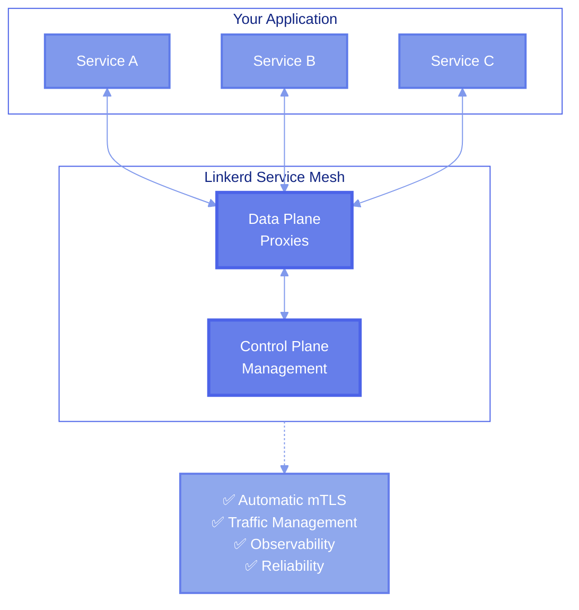
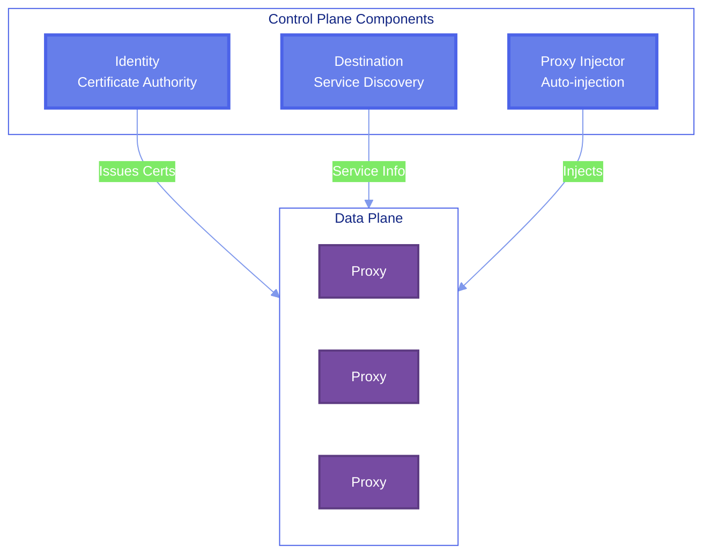
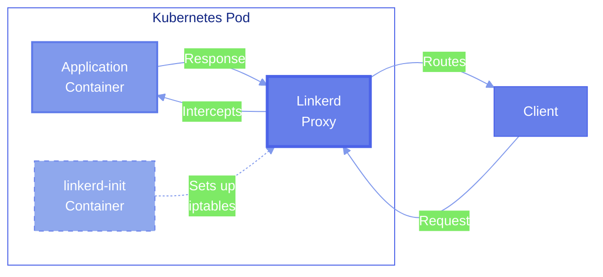
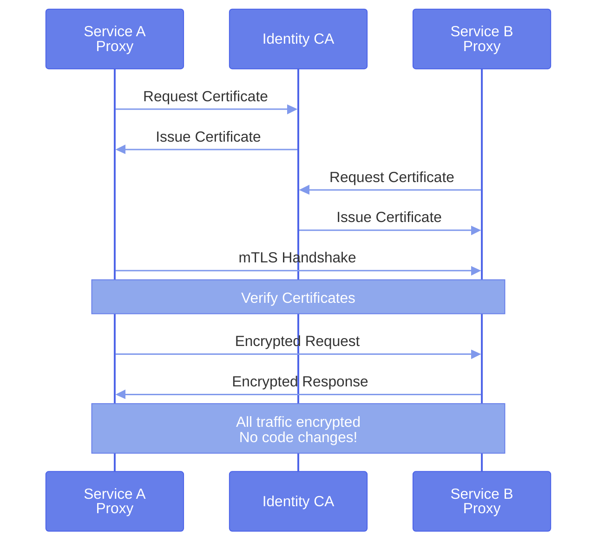
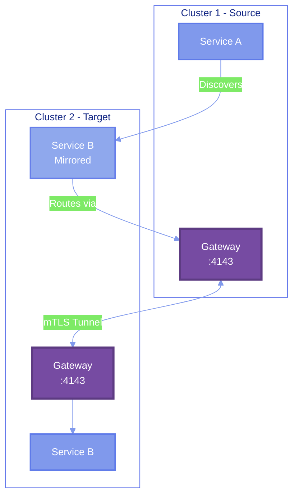
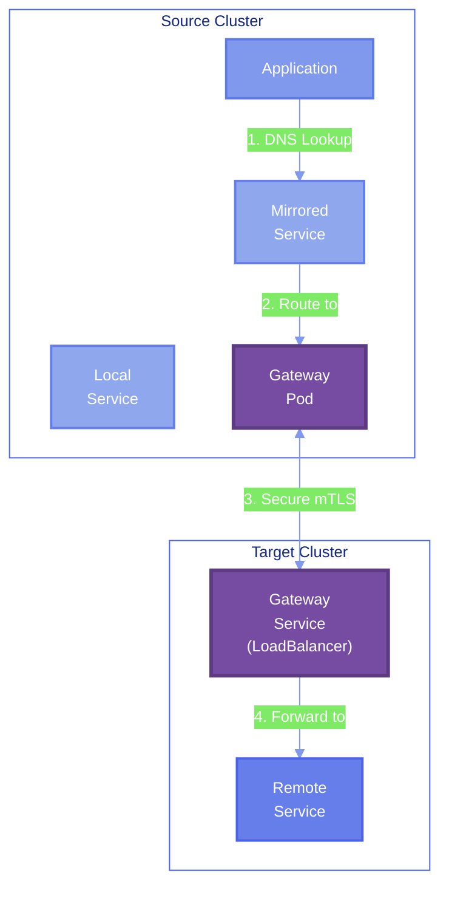
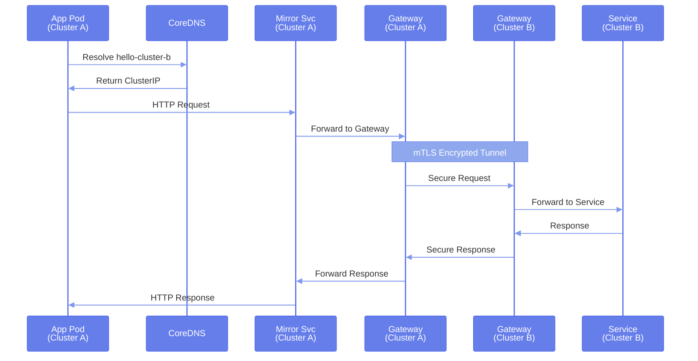
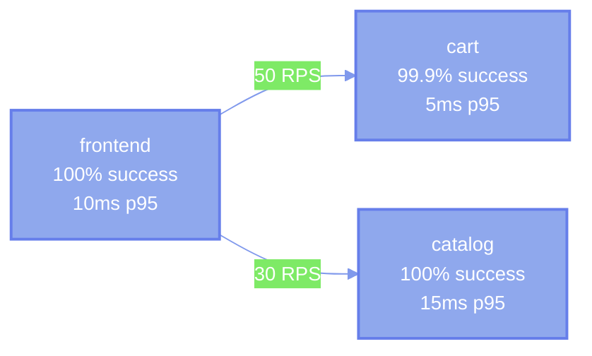

import Tabs from '@theme/Tabs';
import TabItem from '@theme/TabItem';

# Linkerd Service Mesh

## What is Linkerd?

**Linkerd** is an open-source, ultra-light service mesh for Kubernetes. It provides critical features like observability, reliability, and security to your microservices without requiring any code changes to your applications.

:::info Version
This guide uses **Linkerd stable-2.14.10**, a production-ready version optimized for multi-cluster deployments.
:::



## Core Architecture

Linkerd's architecture consists of two main components: the **Control Plane** and the **Data Plane**.

### Control Plane

The control plane is the "brain" of Linkerd, managing and configuring the data plane proxies.



**Key Components:**

| Component | Purpose | Function |
|-----------|---------|----------|
| **Identity** | Certificate Authority | Issues and manages mTLS certificates for all proxies |
| **Destination** | Service Discovery | Provides endpoint information and routing rules |
| **Proxy Injector** | Automatic Injection | Automatically adds Linkerd proxy to pods |

### Data Plane

The data plane consists of lightweight proxies deployed as sidecars alongside your application containers.



**Proxy Responsibilities:**

- **Traffic Interception**: Captures all inbound and outbound traffic
- **mTLS Encryption**: Automatically encrypts communication between services
- **Load Balancing**: Distributes requests across healthy endpoints
- **Metrics Collection**: Gathers detailed telemetry data
- **Circuit Breaking**: Prevents cascading failures

## Key Features

### 1. Automatic Mutual TLS (mTLS)

Linkerd automatically secures all communication between services with mutual TLS encryption.



**Benefits:**
- ✅ Zero-trust security by default
- ✅ Automatic certificate rotation
- ✅ No application code changes required
- ✅ Defense against man-in-the-middle attacks

### 2. Observability

Linkerd provides real-time metrics, distributed tracing, and service topology visualization.

**Metrics Available:**
- Request rate (RPS)
- Success rate
- Latency percentiles (P50, P95, P99)
- TCP-level statistics

**Access via Linkerd Viz:**
```bash
linkerd viz dashboard
```

### 3. Traffic Management

Control how traffic flows between services with powerful routing capabilities.

**Capabilities:**
- Traffic splitting (A/B testing, canary deployments)
- Retries and timeouts
- Circuit breaking
- Load balancing algorithms

### 4. Multi-Cluster Support

Linkerd Multicluster enables secure communication across Kubernetes clusters.



## Linkerd Components

### Core Installation

<Tabs>
<TabItem value="crds" label="CRDs" default>

**Custom Resource Definitions** - Kubernetes API extensions for Linkerd

```bash
linkerd install --crds | kubectl apply -f -
```

Defines resources like:
- `ServiceProfile` - Service-level configuration
- `TrafficSplit` - Traffic splitting rules
- `Link` - Multi-cluster connections

</TabItem>

<TabItem value="control-plane" label="Control Plane">

**Control Plane** - Core Linkerd components

```bash
linkerd install | kubectl apply -f -
```

Deploys:
- Identity service
- Destination service
- Proxy injector

</TabItem>

<TabItem value="viz" label="Linkerd Viz">

**Visualization & Monitoring** - Observability dashboard

```bash
linkerd viz install | kubectl apply -f -
```

Includes:
- Prometheus (metrics storage)
- Grafana (dashboards)
- Web UI (service topology)
- Tap API (real-time traffic inspection)

</TabItem>

<TabItem value="multicluster" label="Multicluster">

**Multi-Cluster Extension** - Cross-cluster communication

```bash
linkerd multicluster install | kubectl apply -f -
```

Provides:
- Gateway (secure tunnel endpoint)
- Service mirror (automatic service discovery)
- Link controller (manages connections)

</TabItem>
</Tabs>

## Linkerd Multicluster

### Architecture

Linkerd Multicluster enables services in one cluster to securely communicate with services in another cluster.



### How It Works

1. **Service Export**: Mark services for export with a label
   ```yaml
   labels:
     to-export: "true"
   ```

2. **Service Mirroring**: Linkerd automatically creates mirror services in linked clusters
   ```
   hello              # Original service (Cluster B)
   hello-cluster-b    # Mirrored service (Cluster A)
   ```

3. **Gateway Routing**: Traffic to mirrored services routes through secure gateways

4. **Transparent Access**: Applications use standard Kubernetes DNS
   ```bash
   curl http://hello-cluster-b:8080
   ```

### Components

| Component | Location | Purpose |
|-----------|----------|---------|
| **Link** | Source Cluster | Defines connection to target cluster |
| **Service Mirror** | Source Cluster | Watches target cluster and creates mirrors |
| **Gateway** | Target Cluster | Provides entry point for cross-cluster traffic |
| **Probe Service** | Source Cluster | Health checks gateway connectivity |

### Traffic Flow Example



## Linkerd Viz Dashboard

Linkerd Viz provides a web-based dashboard for monitoring your service mesh.

### Features

**Service Topology**


**Metrics Available:**
- **Success Rate**: Percentage of successful requests
- **RPS**: Requests per second
- **Latencies**: P50, P95, P99 percentiles
- **TCP Stats**: Bytes sent/received, connection count

### Accessing the Dashboard

```bash
# Start dashboard
linkerd viz dashboard

# Access in browser
open http://localhost:50750
```

### Live Traffic Tap

Inspect live traffic in real-time:

```bash
# Watch requests to a deployment
linkerd viz tap deploy/frontend

# Filter by HTTP method
linkerd viz tap deploy/frontend --method POST

# Watch traffic between services
linkerd viz tap deploy/frontend --to deploy/cart
```

## Benefits for Multi-Cluster Environments

### Security

- **Zero-Trust**: Every connection authenticated and encrypted
- **Certificate Rotation**: Automatic rotation every 24 hours
- **Identity**: Strong identity for every workload

### Reliability

- **Automatic Retries**: Retry failed requests automatically
- **Timeouts**: Prevent hanging requests
- **Circuit Breaking**: Fail fast when services are unhealthy

### Observability

- **Golden Metrics**: Success rate, latency, throughput
- **Service Graph**: Visual representation of service dependencies
- **Distributed Tracing**: Track requests across services and clusters

### Performance

- **Ultra-Light Proxy**: Written in Rust, minimal resource usage
- **Low Latency**: Sub-millisecond proxy overhead
- **No Configuration**: Works out of the box

## Common Use Cases

### 1. Canary Deployments

Gradually roll out new versions:

```yaml
apiVersion: split.smi-spec.io/v1alpha1
kind: TrafficSplit
metadata:
  name: frontend-split
spec:
  service: frontend
  backends:
  - service: frontend-v1
    weight: 90
  - service: frontend-v2
    weight: 10
```

### 2. Cross-Cluster Failover

Route traffic to backup cluster when primary fails:

```yaml
apiVersion: split.smi-spec.io/v1alpha1
kind: TrafficSplit
metadata:
  name: api-failover
spec:
  service: api
  backends:
  - service: api-local
    weight: 100
  - service: api-backup-cluster
    weight: 0
```

### 3. Multi-Tenant Isolation

Separate production and staging clusters:

```
Production Cluster ← → Staging Cluster
      ↓                      ↓
   Services A-Z         Services A-Z (test)
```

## Best Practices

### 1. Certificate Management

- Use a secure trust anchor
- Rotate certificates regularly
- Store CA keys securely

### 2. Resource Limits

Set appropriate resource limits for proxies:

```yaml
resources:
  requests:
    cpu: 100m
    memory: 20Mi
  limits:
    cpu: 1000m
    memory: 250Mi
```

### 3. Namespace Injection

Enable automatic injection per namespace:

```bash
kubectl annotate namespace my-app linkerd.io/inject=enabled
```

### 4. Service Profiles

Define service-level configuration:

```yaml
apiVersion: linkerd.io/v1alpha2
kind: ServiceProfile
metadata:
  name: frontend.default.svc.cluster.local
spec:
  routes:
  - name: GET /api/products
    condition:
      method: GET
      pathRegex: /api/products
    timeout: 1s
    retries:
      limit: 3
```

## Troubleshooting

### Check Linkerd Status

```bash
# Check control plane
linkerd check

# Check data plane
linkerd check --proxy

# Check multicluster
linkerd multicluster check
```

### View Proxy Logs

```bash
# View proxy logs for a pod
kubectl logs <pod-name> -c linkerd-proxy

# Follow logs
kubectl logs <pod-name> -c linkerd-proxy -f
```

### Debug Service Mesh

```bash
# Get proxy statistics
linkerd viz stat deploy

# View service endpoints
linkerd viz endpoints <service>

# Check proxy configuration
linkerd diagnostics proxy-metrics <pod>
```

## Next Steps

Now that you understand Linkerd's architecture and capabilities:

- **[Traffic Management](/docs/local-setup/traffic-splits)** - Learn about TrafficSplits and routing
- **[Creating Clusters](/docs/local-setup/creating-clusters)** - Set up your multi-cluster environment
- **[Installing Linkerd](/docs/local-setup/installing-linkerd)** - Deploy Linkerd in your clusters

---

**Resources:**
- [Official Linkerd Documentation](https://linkerd.io/2.14/overview/)
- [Linkerd Architecture](https://linkerd.io/2.14/reference/architecture/)
- [Multicluster Communication](https://linkerd.io/2.14/features/multicluster/)