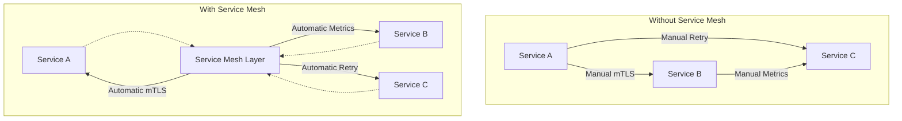
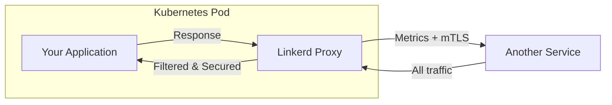
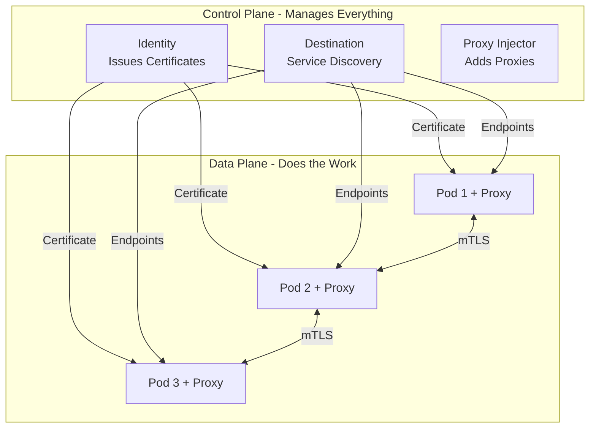
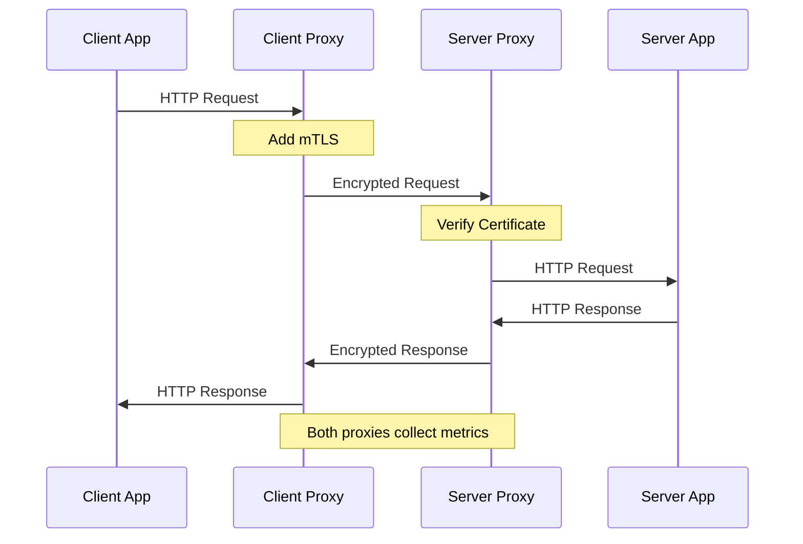
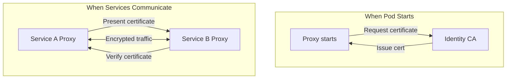
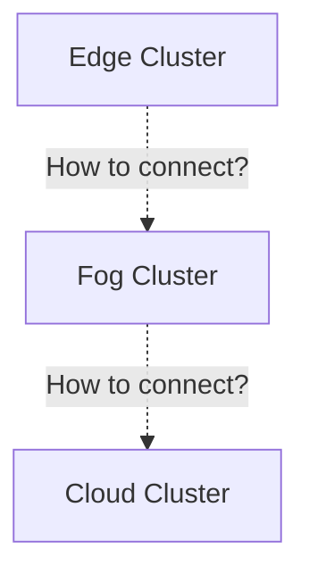
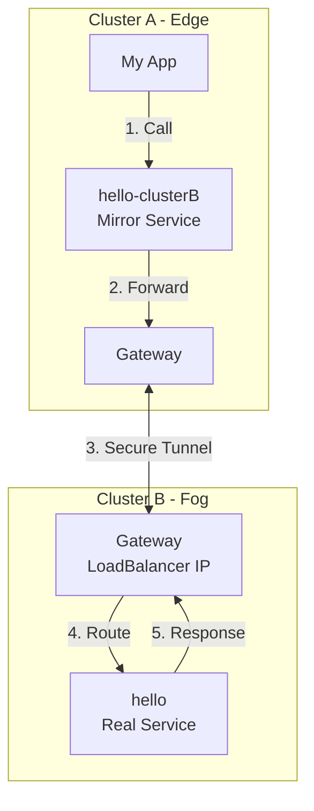
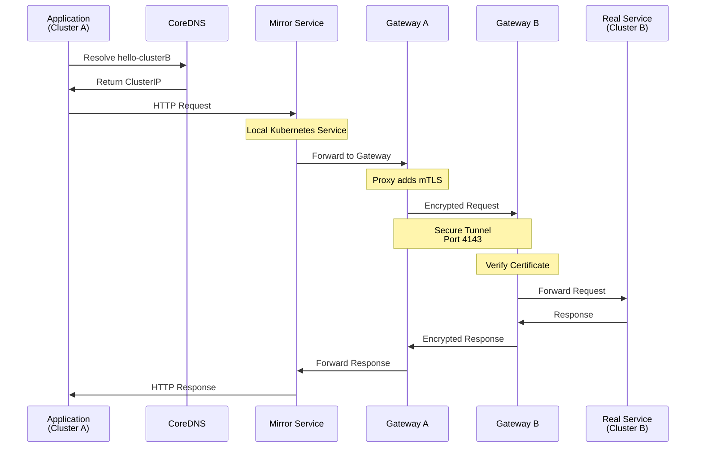
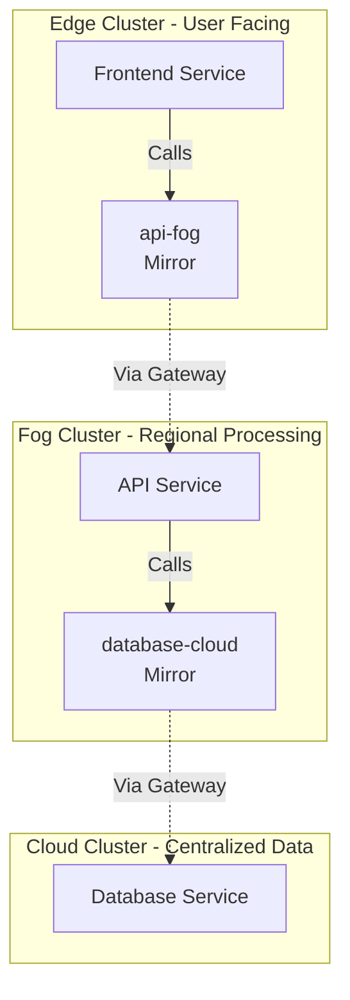
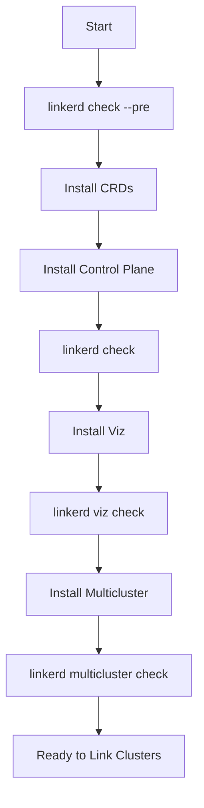

import Tabs from '@theme/Tabs';
import TabItem from '@theme/TabItem';

# Linkerd Service Mesh

## What is a Service Mesh?

A **service mesh** is a dedicated infrastructure layer that handles service-to-service communication in a microservices architecture. Instead of building communication logic into each service, the service mesh provides these capabilities transparently:

- **Secure communication** between services
- **Traffic management** and routing
- **Observability** into service behavior
- **Reliability** features like retries and timeouts



The key insight: your application code doesn't change. The service mesh handles all the complexity.

## Why Linkerd?

**Linkerd** is an ultra-light, security-first service mesh for Kubernetes. Compared to other service meshes:

- **Lightweight**: Minimal resource overhead (written in Rust)
- **Simple**: Works out of the box with zero configuration
- **Fast**: Sub-millisecond latency overhead
- **Secure**: Automatic mTLS by default
- **CNCF**: Cloud Native Computing Foundation graduated project

:::info Version
This guide uses **Linkerd stable-2.14.10**, a production-ready version optimized for multi-cluster deployments.
:::

## How Linkerd Works

Linkerd operates using a **sidecar proxy pattern**. For every pod in your application, Linkerd automatically injects a lightweight proxy container that handles all network traffic.

### The Sidecar Pattern



**What happens:**
1. Linkerd injects a proxy container into your pod
2. All network traffic (in and out) goes through the proxy
3. The proxy adds security, metrics, and reliability
4. Your application sees normal HTTP/gRPC traffic

**What your application doesn't need:**
- No mTLS implementation
- No retry logic
- No metrics collection
- No service discovery code
- No load balancing logic

## Linkerd Architecture

Linkerd consists of two main parts: the **Control Plane** (brain) and the **Data Plane** (workers).



### Control Plane Components

| Component | What it Does | Why You Need It |
|-----------|-------------|-----------------|
| **Identity** | Certificate authority that issues TLS certificates | Enables automatic mTLS between all services |
| **Destination** | Provides service discovery and routing information | Tells proxies where to send traffic |
| **Proxy Injector** | Automatically adds proxy containers to pods | No manual configuration needed |

### Data Plane: The Proxy

Each pod gets a **Linkerd proxy** sidecar that:

1. **Intercepts all traffic** using iptables rules (set up by init container)
2. **Encrypts connections** using mTLS certificates from Identity
3. **Routes requests** to healthy endpoints using info from Destination
4. **Collects metrics** (success rate, latency, request volume)
5. **Provides reliability** (retries, timeouts, load balancing)



## Key Features Explained

### 1. Automatic Mutual TLS (mTLS)

Every service gets a unique identity and certificate. All communication is automatically encrypted.

**How it works:**



**Benefits:**
- ✅ Zero-trust security: every connection authenticated
- ✅ Automatic encryption: no code changes needed
- ✅ Certificate rotation: happens automatically every 24 hours
- ✅ Compliance: meets requirements for encryption in transit

### 2. Traffic Management

Control how requests flow between services.

**Load Balancing:**
- Automatically distributes traffic across healthy pods
- Removes unhealthy pods from rotation
- Uses smart algorithms (EWMA - Exponentially Weighted Moving Average)

**Traffic Splitting:**
```yaml
# Send 90% traffic to v1, 10% to v2 (canary deployment)
apiVersion: split.smi-spec.io/v1alpha1
kind: TrafficSplit
metadata:
  name: my-service-split
spec:
  service: my-service
  backends:
  - service: my-service-v1
    weight: 900
  - service: my-service-v2
    weight: 100
```

### 3. Observability

See what's happening in your system in real-time.

**Golden Metrics** (automatically collected):
- **Success Rate**: % of requests that succeed
- **Request Rate**: requests per second
- **Latency**: how long requests take (P50, P95, P99)

**Access the dashboard:**
```bash
linkerd viz dashboard
```

You'll see:
- Service topology (which services talk to which)
- Live traffic metrics
- Error rates and types
- Latency distributions

### 4. Reliability

Make your services more resilient without changing code.

**Automatic Retries:**
```yaml
# Retry failed requests automatically
apiVersion: linkerd.io/v1alpha2
kind: ServiceProfile
metadata:
  name: my-service
spec:
  routes:
  - condition:
      method: GET
    name: GET /api/data
    retries:
      limit: 3
```

**Timeouts:**
```yaml
# Don't wait forever for responses
spec:
  routes:
  - condition:
      method: POST
    name: POST /api/process
    timeout: 10s
```

## Linkerd Components & Extensions

Linkerd is modular. You install what you need.

### Core Components

<Tabs>
<TabItem value="crds" label="1. CRDs" default>

**What:** Custom Resource Definitions - extends Kubernetes API

**Install:**
```bash
linkerd install --crds | kubectl apply -f -
```

**Why:** Defines new Kubernetes resources like `ServiceProfile`, `TrafficSplit`, and `Link`

</TabItem>

<TabItem value="control-plane" label="2. Control Plane">

**What:** The brain of Linkerd (Identity, Destination, Proxy Injector)

**Install:**
```bash
linkerd install | kubectl apply -f -
```

**Why:** Manages certificates, service discovery, and proxy injection

</TabItem>

<TabItem value="viz" label="3. Linkerd Viz">

**What:** Observability dashboard and metrics

**Install:**
```bash
linkerd viz install | kubectl apply -f -
```

**Includes:**
- Web dashboard
- Prometheus (metrics storage)
- Grafana (visualization)
- Tap (live traffic inspection)

**Why:** See what's happening in your mesh

</TabItem>

<TabItem value="multicluster" label="4. Multicluster">

**What:** Connect services across multiple Kubernetes clusters

**Install:**
```bash
linkerd multicluster install | kubectl apply -f -
```

**Provides:**
- Gateway (secure tunnel between clusters)
- Service Mirror (automatic service discovery)

**Why:** Essential for cloud-fog-edge architecture

</TabItem>
</Tabs>

## Multi-Cluster Communication

This is where Linkerd becomes powerful for cloud-fog-edge architectures.

### The Problem

You have services in different Kubernetes clusters that need to talk to each other:
- Edge cluster needs to access Fog services
- Fog cluster needs to access Cloud services



### The Solution: Linkerd Multicluster

Linkerd creates secure tunnels between clusters and mirrors services automatically.



### How It Works: Step by Step

**Step 1: Mark Services for Export**

In Cluster B (target), label services you want to share:
```bash
kubectl label service hello -n my-namespace to-export=true
```

**Step 2: Link Clusters**

Connect Cluster A (source) to Cluster B (target):
```bash
# This creates the Link resource in Cluster A
linkerd multicluster link --cluster-name clusterB | kubectl apply -f -
```

**Step 3: Automatic Service Mirroring**

Linkerd automatically creates mirror services in Cluster A:
- Original: `hello` (in Cluster B)
- Mirror: `hello-clusterB` (in Cluster A)

**Step 4: Use the Service**

Your application in Cluster A calls it like any other service:
```bash
curl http://hello-clusterB:8080
```

### Components Explained

| Component | Location | Purpose |
|-----------|----------|---------|
| **Gateway** | Target Cluster | LoadBalancer service that accepts incoming cross-cluster traffic |
| **Service Mirror Controller** | Source Cluster | Watches target cluster and creates mirror services |
| **Link Resource** | Source Cluster | Configuration defining connection to target cluster |
| **Probe Service** | Source Cluster | Health checks gateway connectivity |

### Traffic Flow in Detail



## Practical Example: Three-Tier Architecture

Let's see how this works in a cloud-fog-edge setup.



**Request Flow:**
1. User hits Frontend (Edge)
2. Frontend calls `api-fog` service
3. Request routes through Edge→Fog gateway tunnel
4. API in Fog processes request
5. API calls `database-cloud` service
6. Request routes through Fog→Cloud gateway tunnel
7. Database in Cloud responds
8. Response flows back: Cloud→Fog→Edge→User

**What Linkerd Handles:**
- ✅ Service discovery across clusters
- ✅ Automatic mTLS encryption
- ✅ Load balancing across replicas
- ✅ Metrics collection at each hop
- ✅ Automatic retries if requests fail

## Installation Overview

Here's the complete installation flow (detailed steps in hands-on guides):



**Commands:**
```bash
# 1. Install CLI
curl --proto '=https' --tlsv1.2 -sSfL https://run.linkerd.io/install | sh

# 2. Validate
linkerd check --pre

# 3. Install Linkerd
linkerd install --crds | kubectl apply -f -
linkerd install | kubectl apply -f -
linkerd check

# 4. Install Viz
linkerd viz install | kubectl apply -f -
linkerd viz check

# 5. Install Multicluster
linkerd multicluster install | kubectl apply -f -
linkerd multicluster check
```

## Common Commands

### Checking Health

```bash
# Check control plane
linkerd check

# Check data plane proxies
linkerd check --proxy

# Check multicluster
linkerd multicluster check
```

### Viewing Services

```bash
# See all meshed services
linkerd viz stat deploy -n my-namespace

# View service details
linkerd viz stat deploy/my-service

# View endpoints
linkerd viz endpoints my-service
```

### Debugging

```bash
# View proxy logs
kubectl logs <pod-name> -c linkerd-proxy

# Tap live traffic
linkerd viz tap deploy/my-service

# Check what's being injected
linkerd inject deployment.yaml | less
```

### Multicluster Operations

```bash
# View cluster links
linkerd multicluster list

# Check gateways
linkerd multicluster gateways

# View exported services
kubectl get services -l to-export=true --all-namespaces
```

## Best Practices

### 1. Enable Injection Per Namespace

Don't inject everything. Be selective:

```bash
# Enable automatic injection for a namespace
kubectl annotate namespace my-app linkerd.io/inject=enabled

# Deploy - proxies are automatically added
kubectl apply -f my-app.yaml -n my-app
```

### 2. Use Service Profiles

Define expected behavior for better reliability:

```yaml
apiVersion: linkerd.io/v1alpha2
kind: ServiceProfile
metadata:
  name: my-service.my-namespace.svc.cluster.local
spec:
  routes:
  - name: GET /api/users
    condition:
      method: GET
      pathRegex: /api/users
    timeout: 5s
    retries:
      limit: 3
```

### 3. Set Resource Limits

Proxies are lightweight but still need limits:

```yaml
annotations:
  config.linkerd.io/proxy-cpu-limit: "1"
  config.linkerd.io/proxy-cpu-request: "100m"
  config.linkerd.io/proxy-memory-limit: "250Mi"
  config.linkerd.io/proxy-memory-request: "20Mi"
```

### 4. Label Services for Export

Be explicit about what crosses cluster boundaries:

```bash
# Only export what needs to be accessed from other clusters
kubectl label service api to-export=true
kubectl label service internal-worker to-export=false
```

## Troubleshooting

### Gateway Not Reachable

```bash
# Check gateway has LoadBalancer IP
kubectl get svc -n linkerd-multicluster

# Check gateway pod is running
kubectl get pods -n linkerd-multicluster -l app=linkerd-gateway

# Test connectivity from source cluster
kubectl exec -it <pod> -- curl -v http://gateway-ip:4143/health
```

### Services Not Being Mirrored

```bash
# Check service mirror controller logs
kubectl logs -n linkerd-multicluster -l component=controller

# Verify Link resource exists
kubectl get links -A

# Check service has export label
kubectl get svc <service-name> -o yaml | grep to-export
```

### mTLS Not Working

```bash
# Check Identity certificates
linkerd identity

# View certificate expiration
kubectl get secret -n linkerd linkerd-identity-issuer -o yaml

# Check proxy can reach Identity
kubectl logs <pod> -c linkerd-proxy | grep identity
```

## What's Next?

Now that you understand Linkerd:

1. **[Traffic Splits](/docs/local-setup/traffic-splits)** - Learn how to split traffic between services
2. **[K3s & K3d](/docs/local-setup/k3s-k3d)** - Understand the Kubernetes distribution we'll use
3. **[Creating Clusters](/docs/local-setup/creating-clusters)** - Build your multi-cluster environment
4. **[Installing Linkerd](/docs/local-setup/installing-linkerd)** - Hands-on installation guide
5. **[Linking Clusters](/docs/local-setup/linking-clusters)** - Connect your clusters together

---

**Resources:**
- [Official Linkerd Docs](https://linkerd.io/2.14/overview/)
- [Linkerd Architecture Deep Dive](https://linkerd.io/2.14/reference/architecture/)
- [Multicluster Guide](https://linkerd.io/2.14/features/multicluster/)