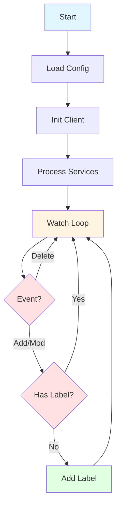

import Tabs from "@theme/Tabs";
import TabItem from "@theme/TabItem";

# Service Auto-Exporter Controller

:::tip Quick Start
Deploy in 2 minutes with our [complete Kubernetes deployment](#kubernetes-deployment) manifest.
:::

The **Service Auto-Exporter** is a lightweight Kubernetes controller that automatically adds specific labels to all Services within a target namespace. It's designed primarily to support systems like **Linkerd multicluster mirroring**, where services require specific export labels (e.g., `mirror.linkerd.io/exported=true`).

## Overview

This controller provides automatic label management for Kubernetes Services:

- 🔄 Processes **all existing Services** in a namespace on startup
- 👀 Watches for **new or updated Services** continuously
- 🏷️ Automatically adds target export labels (key + value)
- 🛡️ Skips Kubernetes system Services
- 🚀 Runs both **in-cluster** and **out-of-cluster** (via `--kubeconfig`)

## How It Works



### Workflow Details

1. **Startup Phase**

   - Loads configuration from CLI flags
   - Initializes Kubernetes client (in-cluster or from kubeconfig)
   - Processes all existing Services in the configured namespace

2. **Continuous Watch**

   - Monitors for `ADDED`, `MODIFIED`, and `DELETED` events
   - Ensures each Service contains the required export label
   - Ignores Services already labeled correctly

3. **Label Injection**
   - Deep copies the Service object
   - Adds or updates the label
   - Performs a Kubernetes API update call

## Configuration

### Command-Line Flags

| Flag           | Default                      | Description                                        |
| -------------- | ---------------------------- | -------------------------------------------------- |
| `--namespace`  | `default`                    | Namespace to monitor for Services                  |
| `--label`      | `mirror.linkerd.io/exported` | Label key to apply                                 |
| `--value`      | `true`                       | Label value to apply                               |
| `--kubeconfig` | _(empty)_                    | Path to kubeconfig (optional, for local execution) |
| `-v`           | `0`                          | Log verbosity level (0-4)                          |

### Example Usage

<Tabs>
<TabItem value="basic" label="Basic" default>

```bash
service-auto-exporter \
  --namespace=emojivoto \
  --label=mirror.linkerd.io/exported \
  --value=true
```

</TabItem>
<TabItem value="custom" label="Custom Label">

```bash
service-auto-exporter \
  --namespace=production \
  --label=export.custom.io/enabled \
  --value=yes \
  -v=2
```

</TabItem>
<TabItem value="local" label="Local Development">

```bash
service-auto-exporter \
  --kubeconfig=~/.kube/config \
  --namespace=test \
  --label=mirror.linkerd.io/exported \
  --value=true \
  -v=2
```

</TabItem>
</Tabs>

## Deployment

### Kubernetes Deployment

Deploy the controller with full RBAC configuration:

```yaml
---
apiVersion: v1
kind: Namespace
metadata:
  name: defog
  annotations:
    linkerd.io/inject: enabled
---
apiVersion: v1
kind: ServiceAccount
metadata:
  name: service-auto-exporter
  namespace: defog
---
apiVersion: rbac.authorization.k8s.io/v1
kind: ClusterRole
metadata:
  name: service-auto-exporter
rules:
  - apiGroups: [""]
    resources: ["services"]
    verbs: ["get", "list", "watch", "update", "patch"]
---
apiVersion: rbac.authorization.k8s.io/v1
kind: ClusterRoleBinding
metadata:
  name: service-auto-exporter
roleRef:
  apiGroup: rbac.authorization.k8s.io
  kind: ClusterRole
  name: service-auto-exporter
subjects:
  - kind: ServiceAccount
    name: service-auto-exporter
    namespace: defog
---
apiVersion: v1
kind: ConfigMap
metadata:
  name: service-auto-exporter-config
  namespace: defog
data:
  TARGET_NAMESPACE: "test"
  EXPORT_LABEL: "to-export"
  EXPORT_VALUE: "true"
---
apiVersion: apps/v1
kind: Deployment
metadata:
  name: service-auto-exporter
  namespace: defog
  labels:
    app: service-auto-exporter
spec:
  replicas: 1
  selector:
    matchLabels:
      app: service-auto-exporter
  template:
    metadata:
      labels:
        app: service-auto-exporter
    spec:
      serviceAccountName: service-auto-exporter
      containers:
        - name: controller
          image: aprountzos/service-auto-exporter:v1
          imagePullPolicy: IfNotPresent
          args:
            - -namespace=$(TARGET_NAMESPACE)
            - -label=$(EXPORT_LABEL)
            - -value=$(EXPORT_VALUE)
            - -v=2
          env:
            - name: TARGET_NAMESPACE
              valueFrom:
                configMapKeyRef:
                  name: service-auto-exporter-config
                  key: TARGET_NAMESPACE
            - name: EXPORT_LABEL
              valueFrom:
                configMapKeyRef:
                  name: service-auto-exporter-config
                  key: EXPORT_LABEL
            - name: EXPORT_VALUE
              valueFrom:
                configMapKeyRef:
                  name: service-auto-exporter-config
                  key: EXPORT_VALUE
          resources:
            requests:
              cpu: 100m
              memory: 64Mi
            limits:
              cpu: 200m
              memory: 128Mi
```

### Apply the Deployment

```bash
kubectl apply -f service-auto-exporter.yaml
```

### Verify Deployment

```bash
# Check controller pod status
kubectl get pods -n defog -l app=service-auto-exporter

# View controller logs
kubectl logs -n defog -l app=service-auto-exporter -f

# Verify services are being labeled
kubectl get services -n test --show-labels
```

## Behavior & Features

### ✅ Processes Existing Services

On startup, all Services in the target namespace are scanned. If a Service is missing the configured label, the controller updates it immediately.

### ✅ Watches for New/Updated Services

Using a Kubernetes `watch.Interface`, the controller continuously reacts to Service changes:

```go
case watch.Added, watch.Modified:
    // Process and add label if needed
```

### ✅ Skips System Services

Services with names beginning with `"kubernetes"` are automatically ignored to prevent interference with cluster internals.

### ✅ Safe Updates

Services are deep-copied before modification to prevent race conditions:

```go
updatedSvc := svc.DeepCopy()
```

The controller only updates Services when the label is missing or incorrect, avoiding unnecessary API calls.

## Use Cases

The Service Auto-Exporter is particularly useful when:

- ✨ You need **automatic propagation** of labels required by service mesh or multicluster tools
- 👥 Developers frequently create Services, making consistent labeling difficult
- 🎯 You want a minimal controller without the overhead of a full operator framework
- 🔗 You're using **Linkerd multicluster** and need automatic service export
- 🏢 You have compliance requirements for service labeling across namespaces

## Example Behavior

| Service Name  | Before                | After                                |
| ------------- | --------------------- | ------------------------------------ |
| `web-svc`     | No label              | `mirror.linkerd.io/exported=true` ✅ |
| `redis`       | Incorrect label value | Updated to correct value ✅          |
| `kubernetes`  | System service        | Ignored (no changes) ⏭️              |
| `api-gateway` | Already correct       | No update needed ⏭️                  |

## Architecture

### Code Structure

The controller is organized into clean, focused components:

#### Config

Holds CLI options and configuration parameters.

#### Controller

Contains the Kubernetes client and core logic for processing Services.

#### Key Methods

- `Run(ctx)` — Orchestrates startup and watch loop
- `processExistingServices()` — Scans all existing Services on startup
- `watchServices()` — Watches Service events continuously
- `processService()` — Applies the export label to a Service

## Logging

The controller uses `klog` for structured logging with configurable verbosity.

### Log Levels

<Tabs>
<TabItem value="minimal" label="Minimal (-v=0)" default>

```bash
# Only errors and critical information
service-auto-exporter --namespace=test -v=0
```

</TabItem>
<TabItem value="normal" label="Normal (-v=1)">

```bash
# Standard operational logs
service-auto-exporter --namespace=test -v=1
```

</TabItem>
<TabItem value="verbose" label="Verbose (-v=2)">

```bash
# Detailed operation logs (recommended)
service-auto-exporter --namespace=test -v=2
```

</TabItem>
</Tabs>

### Example Log Output

```log
I Starting Service Auto-Exporter Controller
I Target namespace: emojivoto
I Export label: mirror.linkerd.io/exported=true
I Processed 3 existing services
I Adding export label to service: web-svc
I Successfully added export label to service: web-svc
I Watching for service changes...
```

## Development

### Building from Source

```bash
# Clone repository
git clone https://github.com/yourusername/service-auto-exporter
cd service-auto-exporter

# Build binary
go build -o service-auto-exporter

# Run locally
./service-auto-exporter --kubeconfig ~/.kube/config --namespace default
```

### Running Locally

For local development and testing:

```bash
go run main.go \
  --kubeconfig ~/.kube/config \
  --namespace test \
  --label mirror.linkerd.io/exported \
  --value true \
  -v=2
```

### Testing

```bash
# Run unit tests
go test ./...

# Run with race detector
go test -race ./...
```

## Troubleshooting

### Controller not starting

Check RBAC permissions:

```bash
kubectl auth can-i update services --as=system:serviceaccount:defog:service-auto-exporter
```

### Services not being labeled

1. Verify the controller is running:

   ```bash
   kubectl get pods -n defog -l app=service-auto-exporter
   ```

2. Check controller logs:

   ```bash
   kubectl logs -n defog -l app=service-auto-exporter
   ```

3. Verify target namespace exists:
   ```bash
   kubectl get namespace test
   ```

### Permission errors

Ensure ClusterRole includes all required verbs:

```yaml
verbs: ["get", "list", "watch", "update", "patch"]
```

## FAQ

<details>
<summary>Can I monitor multiple namespaces?</summary>

Currently, the controller monitors a single namespace. Deploy multiple instances with different configurations to monitor multiple namespaces.

</details>

<details>
<summary>What happens if I change the label key or value?</summary>

The controller will update all Services with the new label on its next reconciliation pass. Old labels are not automatically removed.

</details>

<details>
<summary>Does this work with Istio or other service meshes?</summary>

Yes! While designed for Linkerd, you can configure any label key/value pair, making it compatible with any system requiring Service labels.

</details>

<details>
<summary>How much overhead does this add?</summary>

Minimal. The controller uses Kubernetes watch mechanisms (not polling) and only updates Services when necessary. Resource usage is typically under 100m CPU and 64Mi memory.

</details>

## Contributing

Contributions are welcome! Please feel free to submit issues or pull requests.

## License

[Your License Here]

---

**Questions or issues?** Please open an issue on [GitHub](https://github.com/yourusername/service-auto-exporter).
